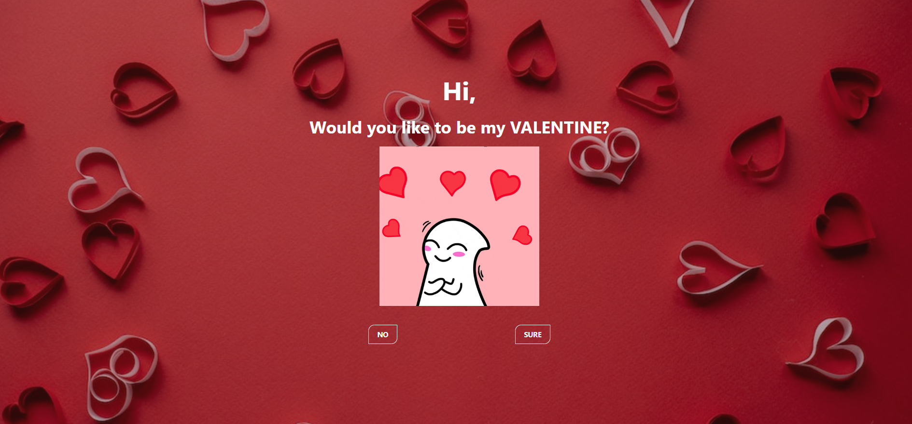

# Valentine Letter

> Created by <a href="https://www.github.com/githiomi"> Daniel Githiomi </a>

## 🚧 Description

`Valentine Letter` is a simple web application that I created using HTML, CSS and Vanila JS to make use of my coding skills to ask a girl to be my valentines on February the 14th.

## 👀 Product Preview

## 🏗️ Live Pages

You can view the the website using the GitHub live pages.

* Link: [Valentine Letter](https://githiomi.github.io/Valentines-Letter)

## 📧 Support and contact details

Contact me through any of the following:

* LinkedIn: Daniel Githiomi
* Email: danielgithiomi@gmail.com
* Github: githiomi

## 📃 License

Click the following to access the license
page: [Click-Here](https://githiomi.github.io/Privacy-Policy/)

> Copyright (c) {2024} DhosioLux Co.
